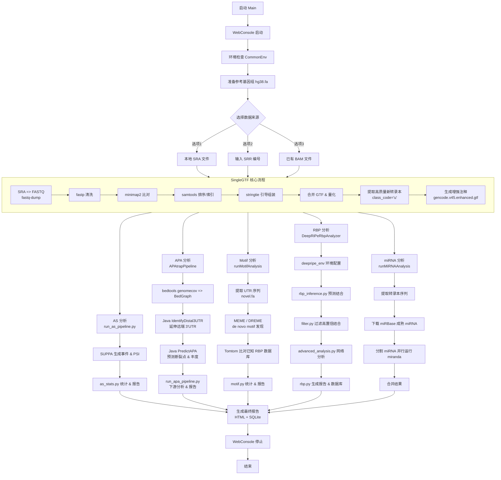

# RNA-seq转录后调控全景分析流程

本项目实现了一套完整的RNA-seq数据分析流程，旨在系统鉴定转录后调控事件，包括可变剪接（AS）、可变多聚腺苷酸化（APA）、RNA结合蛋白（RBP）结合位点、miRNA靶点以及序列Motif特征。流程整合了主流生物信息学工具与深度学习模型，从原始测序数据出发，逐步完成比对、转录本组装、注释增强、调控事件检测与可视化，最终生成可用于生物学假设检验的交互式报告和结构化数据库。

## 分析流程概览

整体流程分为数据预处理、核心调控分析、结果整合与可视化三个阶段。



### 第一阶段：数据预处理与注释增强

- **原始数据获取**：支持直接输入本地SRA/FASTQ/BAM文件，或通过SRA编号自动下载（`prefetch`）。
- **质控与清洗**：`fastp` 去除低质量碱基、接头、polyG/polyX，并进行长度过滤。
- **比对**：`minimap2` 以 splice-aware模式比对至hg38参考基因组。
- **转录本组装**：`StringTie` 利用参考注释（GENCODE v45）进行引导组装，每个样本独立生成GTF。
- **合并与量化**：所有样本的GTF合并为非冗余转录本集合，并重新量化表达（TPM）。
- **高质量新转录本筛选**：基于`gffcompare`的class_code “u”及样本支持数（≥3个样本，平均TPM>0.1）提取可靠的新转录本。
- **增强注释生成**：将筛选后的新转录本追加至表达参考注释，形成`gencode.v45.enhanced.gtf`，用于后续所有分析。

### 第二阶段：转录后调控事件分析

#### 1. 可变剪接（AS）分析
- 使用`SUPPA2`从增强注释中生成五种常见事件类型：外显子跳跃（SE）、可变5’/3’剪接位点（SS）、互斥外显子（MX）、内含子保留（RI）和可变第一个/最后一个外显子（FL）。
- 基于样本TPM矩阵，计算每个事件在所有样本中的百分剪接指数（PSI）。
- 输出事件级别的PSI矩阵和IOE文件，支持差异剪接分析。

#### 2. 可变多聚腺苷酸化（APA）分析
- 基于Java重实现的APAtrap算法（`IdentifyDistal3UTR` + `PredictAPA`），避免Perl依赖并提升性能。
- 从BAM文件生成每个样本的BedGraph覆盖度（`bedtools genomecov`）。
- 从增强注释中提取3’UTR坐标，并依据覆盖度信号延伸远端UTR区域。
- 预测每个基因的内部APA位点（断裂点），并计算每个位点在各样本中的相对使用丰度。
- 输出位点级别的丰度矩阵和基因级别汇总。

#### 3. RNA结合蛋白（RBP）结合预测
- 采用DeepRiPe深度学习模型（`tensorflow 2.13`），该模型针对PARCLIP数据训练，覆盖70余种人类RBP。
- 将增强注释中的新转录本序列（`novel.fa`）输入模型，输出每个RBP的结合概率（0~1）。
- 对预测结果进行阈值过滤（score > 0.5）和共结合网络分析。
- 生成包含结合频率、得分分布、共现网络和序列×RBP热图的交互式HTML报告。

#### 4. miRNA靶点预测
- 从增强注释提取转录本全长序列，下载miRBase成熟miRNA序列（人类条目）。
- 使用`miranda`进行靶点扫描，设置严格能量阈值（-en -5.0）。
- 并行化运行（16线程）提高处理速度，合并所有输出。
- 输出包含miRNA-转录本配对、结合位点位置和自由能的表格。

#### 5. Motif富集与注释
- 提取含有APA事件的基因的3’UTR序列（或新转录本序列）。
- 使用MEME套件进行de novo motif发现（MEME for 宽motif，DREME for 短motif）。
- 将发现的motif与已知RBP数据库（Ray2013）比对（Tomtom），识别潜在的调控因子。
- 生成包含motif长度分布、E-value排序、背景频率及Tomtom匹配结果的统计报告。

### 第三阶段：结果整合与可视化

- 每个分析模块均生成**SQLite数据库**，便于后续批量查询和二次分析。
- 所有图表（条形图、箱线图、热图、网络图、t-SNE等）使用**Plotly**构建，支持深色主题的交互式HTML报告。
- 提供**统一入口网页控制台**（端口11451），可实时监控分析日志、系统资源，并模拟终端输入。

## 运行环境与依赖

- **操作系统**：Linux
- **核心依赖**：Conda (Miniconda3) 自动管理环境
    - `common_env`：包含minimap2, fastp, stringtie, gffcompare, suppa, miranda, bedtools, samtools, pandas, numpy, matplotlib, seaborn, scipy, scikit-learn等
    - `meme_env`：MEME suite (Python 3.6)
    - `deepripe_env`：tensorflow 2.13, biopython, networkx, plotly

## 使用方法

1. 直接运行已打包的JAR。
2. 网页控制台自动打开，地址 `http://localhost:11451`。
3. 根据提示选择数据来源：
    - 选项1：指定本地SRA文件或目录
    - 选项2：输入SRR编号（支持逗号分隔和范围，规则同Office套件打印界面的页码指定）
    - 选项3：提供已处理好的BAM文件（可附加`-y`标志跳过排序）
4. 流程将自动依次执行所有模块，无需人工干预。各模块若检测到已有结果文件（如`stats.db`, `rbp_data.db`）则自动跳过。
5. 最终输出目录结构：
   ```
   ├── as/                     # 可变剪接结果
   │   ├── expressed/          # 基于表达注释的事件/PSI
   │   ├── enhanced/           # 基于增强注释的事件/PSI
   │   ├── stats.db            # PSI详细数据
   │   └── as_report.html      # 交互式报告
   ├── apa/                    # APA分析结果
   │   ├── bedgraph/           # 样本覆盖度文件
   │   ├── utr/                # 远端3'UTR BED
   │   ├── results/            # APA位点丰度、汇总表、数据库
   │   └── apa_report.html
   ├── rbp/                    # RBP预测结果
   │   ├── rbp_predictions.csv # 全量预测
   │   ├── rbp_predictions_binding_true.csv # 高置信结合
   │   ├── rbp_data.db
   │   └── rbp_report.html
   ├── mirna/                  # miRNA靶点结果
   │   └── miranda_results.txt
   └── motif/                  # Motif分析结果
       ├── meme_results/
       ├── dreme_results/
       ├── tomtom_results/
       ├── motifs.db
       └── motif_report.html
   ```